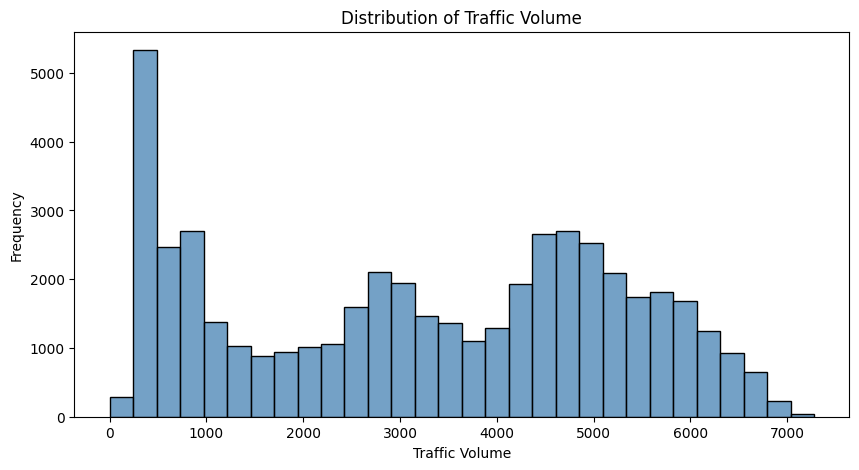
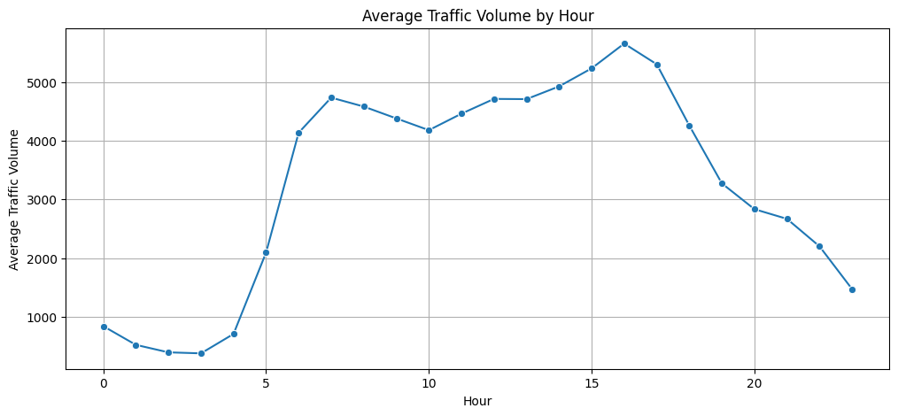
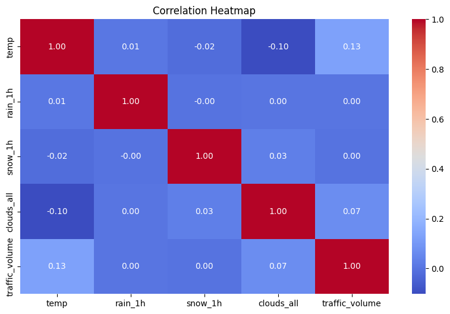
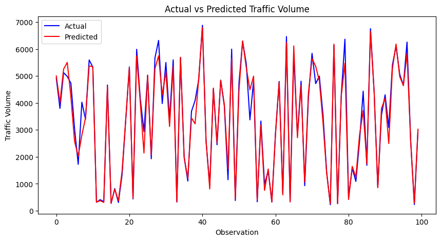

# Urban Traffic Congestion Prediction and Analysis Using Machine Learning

## Project Overview

This project focuses on analyzing urban traffic patterns and building a machine learning model to predict traffic volume using historical traffic data, weather conditions, and time-based features.

The project follows an end-to-end data science workflow including data preprocessing, exploratory data analysis, feature engineering, machine learning model development, and evaluation.

---

## Objectives

- Analyze traffic patterns based on time and weather conditions.
- Identify factors affecting traffic volume.
- Perform data cleaning and feature engineering.
- Build machine learning models for traffic volume prediction.
- Compare different regression models and select the best-performing model.

---

## Dataset

**Dataset Name:** Metro Interstate Traffic Volume

The dataset contains traffic observations along with weather and time information.

### Features

- holiday
- temperature
- rainfall
- snowfall
- cloud coverage
- weather conditions
- date and time

### Target Variable

- traffic_volume

Dataset size:

- 48,204 observations
- 9 original features

---

## Technologies Used

- Python
- Pandas
- NumPy
- Matplotlib
- Seaborn
- Scikit-learn
- Jupyter Notebook

---

## Project Workflow

### 1. Data Collection
Loaded the Metro Interstate Traffic Volume dataset.

### 2. Data Cleaning
- Handled missing values.
- Removed duplicate records.
- Converted date-time information.

### 3. Feature Engineering
Created new features:

- Hour
- Day
- Month
- Year
- Day of Week

### 4. Exploratory Data Analysis

Analyzed:

- Traffic distribution
- Hourly traffic patterns
- Weekly traffic trends
- Weather impact on traffic
- Feature correlations
- ## Visualizations

### Traffic Volume Distribution

### Traffic Volume by Hour

### Correlation Heatmap

### Actual vs Predicted Traffic Volume

### 5. Machine Learning Models

Implemented:

- Linear Regression
- Random Forest Regressor
- Gradient Boosting Regressor

---

## Model Performance

| Model | R² Score |
|------|---------|
| Random Forest | 0.967 |
| Gradient Boosting | 0.920 |
| Linear Regression | -3.093 |

### Best Model

Random Forest Regressor achieved the best performance with an R² Score of **0.967**.

---

## Project Structure
urban-traffic-congestion-prediction/

│
├── data/
│ └── raw/
│ └── Metro_Interstate_Traffic_Volume.csv
│
├── notebooks/
│ └── 01_traffic_data_analysis.ipynb
│
├── models/
│ └── traffic_volume_prediction_model.zip
│
├── README.md
---

## How to Run

1. Clone the repository.

2. Install required libraries:

pip install -r requirements.txt

3. Open the notebook:

notebooks/01_traffic_data_analysis.ipynb

4. Run all cells to reproduce the analysis and model training.

---

## Conclusion

This project demonstrates an end-to-end machine learning approach for urban traffic analysis and prediction.

The Random Forest model successfully captured complex relationships between weather conditions, time features, and traffic volume, achieving strong prediction performance.
This project highlights the application of data science techniques in solving real-world transportation problems.
